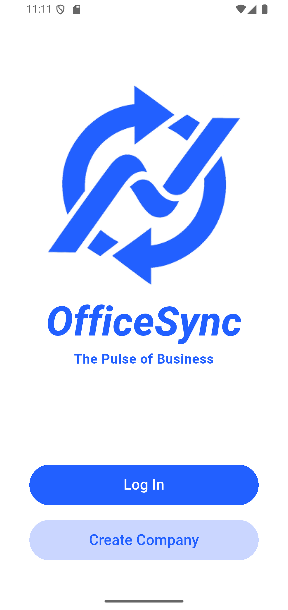

# OFFICESYNC

<p align="center">
  
</p>

## TỔNG QUANG

**OfficeSync** là nền tảng quản lý vận hành và cộng tác doanh nghiệp toàn diện, tích hợp các phân hệ chuyên sâu như HR, Attendance, Task, **Chat nội bộ thời gian thực (Real-time)** và trợ lý ảo AI.

Ứng dụng di động (Flutter) được thiết kế theo kiến trúc **Feature-First**, tối ưu hóa khả năng mở rộng. 
Hệ thống Backend vận hành theo mô hình Microservices trên nền tảng **Java 21 & Spring Boot**, kết hợp **Docker** để triển khai linh hoạt các dịch vụ (Gateway, Database, Redis...), đảm bảo hiệu năng cao và tính ổn định.

## TECH STACK

### Client (Mobile)


-orange?style=flat-square)


### Backend (Server)


### Database & Storage
-4479A1?style=flat-square&logo=mysql&logoColor=white)
-DC382D?style=flat-square&logo=redis&logoColor=white)


### Async & Realtime

-00c853?style=flat-square&logo=socket.io&logoColor=white)


### Infrastructure & DevOps


## MÔ TẢ CHỨC NĂNG HỆ THỐNG

**1. Phân hệ Định danh & Bảo mật (Identity & Security)**

Đảm bảo an toàn và kiểm soát quyền truy cập vào hệ thống.

- Đăng ký (Registration): Cho phép khởi tạo Tenant (công ty mới) vào hệ thống.

- Đăng nhập (Authentication): Xác thực qua Email/Password, cấp phát JWT Token.

- Bảo mật 2 lớp (2FA/OTP): Gửi mã OTP qua email khi đăng ký mới hoặc thực hiện quy trình Quên mật khẩu.

- Khôi phục mật khẩu: Quy trình tự động lấy lại mật khẩu qua Email xác thực.

- Cơ chế "Hard Kick": Tự động đăng xuất phiên làm việc cũ nếu phát hiện đăng nhập trên thiết bị mới hoặc khi tài khoản bị Admin khóa (Force Logout).

- Đổi mật khẩu: Cho phép người dùng thay đổi mật khẩu cá nhân.

**2. Phân hệ Hạ tầng & Tích hợp (Infrastructure)**

Các dịch vụ nền tảng hỗ trợ vận hành hệ thống.

- API Gateway: Cổng giao tiếp duy nhất, điều hướng request, lọc bảo mật (Security Filter).

- Service Discovery (Eureka): Quản lý các microservices, cân bằng tải.

- Analytics: Tích hợp Firebase để phân tích hành vi người dùng và theo dõi lỗi (Crashlytics).

- Trợ lý ảo AI: Chatbot hỗ trợ nhân viên tra cứu nhanh thông tin chấm công.

- Notification Service: Hệ thống đẩy thông báo Real-time (FCM) không cần gọi API liên tục.

**3. Phân hệ Quản trị Hệ thống (Dành cho Super Admin)**

Quản lý tổng thể các công ty (Tenants) sử dụng dịch vụ.

- Quản lý Công ty (Tenant Management): Xem danh sách, Khóa (Lock)/Mở khóa (Unlock) công ty (ví dụ: khi hết hạn gói cước).

- Quản lý Tài khoản Global: Tra cứu, theo dõi trạng thái và can thiệp khóa/mở khóa bất kỳ tài khoản người dùng nào trên toàn hệ thống nếu vi phạm.

- Dashboard & Báo cáo: Biểu đồ tăng trưởng người dùng, thống kê số lượng công ty/user active theo thời gian thực.

**4. Phân hệ Quản lý Tổ chức & Nhân sự (HR Core)**

Dành cho Company Admin và Manager.

- Cấu hình Doanh nghiệp: Cập nhật thông tin công ty (Logo, Tên, Website, Lĩnh vực).

- Quản lý Cơ cấu tổ chức: Tạo/Sửa/Xóa phòng ban, Bổ nhiệm Trưởng phòng (Manager), Điều chuyển nhân sự.

- Quản lý Hồ sơ nhân viên:

  - Tạo tài khoản mới (cấp email/pass mặc định).

  - Cập nhật thông tin, chức vụ.

  - Khóa/Xóa tài khoản khi nhân viên nghỉ việc.

- Thống kê nhân sự: Tìm kiếm nâng cao, xem danh sách nhân viên theo phòng ban.

**5. Phân hệ Quản lý Chấm công (Attendance)**

- Cấu hình (Company Admin):

  - Thiết lập vị trí văn phòng (GPS/Geofencing) và bán kính cho phép.

  - Thiết lập mạng Wifi hợp lệ (SSID/MAC Address).

  - Cài đặt giờ làm việc tiêu chuẩn.

- Thực hiện Chấm công (Staff): Check-in/Check-out thông minh, hệ thống tự động validate vị trí và mạng internet.

- Quản lý & Theo dõi (Manager/Admin):

  - Xem lịch sử chấm công của nhân viên cấp dưới.

  - Báo cáo tình trạng đi muộn/về sớm.

  - AI Support: Tra cứu dữ liệu chấm công qua Chatbot.

**6. Phân hệ Quản lý Đơn từ (Request & Approval)**

Quy trình xin phép và phê duyệt điện tử.

- Tạo đơn (Staff): Tạo đơn nghỉ phép, tăng ca, đi muộn/về sớm. Đính kèm ảnh/video minh chứng (Storage Service).

- Xử lý đơn (Manager):

  - Nhận thông báo khi có đơn mới.

  - Xem chi tiết lý do và minh chứng.

  - Thao tác: Duyệt (Approve) hoặc Từ chối (Reject) kèm lý do.

- Theo dõi trạng thái: Nhân viên xem trạng thái đơn, hủy đơn nếu chưa được duyệt. Lịch sử đơn từ.

**7. Phân hệ Quản lý Công việc (Task Management)**

Mô hình giao việc phân cấp: Admin -> Manager -> Staff.

- Giao việc: Cấp trên tạo nhiệm vụ, gán cho cấp dưới, đặt thời hạn.

- Cập nhật tiến độ: Chuyển trạng thái (Todo -> In Progress -> Done).

- Báo cáo: Thống kê công việc hoàn thành/quá hạn theo tháng/năm.

- Bộ lọc: Lọc theo phòng ban, nhân viên, trạng thái.

**8. Phân hệ Truyền thông & Cộng tác (Communication)**

- Newsfeed (Bảng tin nội bộ):

  - Company Admin: Đăng thông báo quan trọng, ghim tin, xem thống kê tương tác.

  - Manager: Đăng tin nội bộ.

  - Staff: Xem tin, nhận thông báo, thả cảm xúc (Reaction).

- Chat (Tin nhắn):

  - Đồng bộ: Tự động thêm nhân viên vào nhóm chat chung/nhóm phòng ban khi tạo tài khoản hoặc chuyển phòng.

  - Tính năng: Chat cá nhân (1-1), Chat nhóm, gửi tin nhắn văn bản/đa phương tiện.

  - Trạng thái: Thông báo tin nhắn chờ khi không hoạt động.

**9. Tiện ích Cá nhân (Personal Utilities)**

- Ghi chú (Note Service): Tạo/Sửa/Xóa ghi chú cá nhân. Hỗ trợ định dạng văn bản (font, màu), cài mã PIN cho ghi chú mật.

- Hồ sơ cá nhân: Cập nhật Avatar, số điện thoại, đổi mật khẩu.

**10. Các tính năng chung (General Features)**
- Phân quyền (RBAC): Cơ chế kế thừa quyền hạn (Super Admin > Company Admin > Manager > Staff).

- Tìm kiếm & Bộ lọc nâng cao: Áp dụng cho mọi danh sách (Nhân sự, Công việc, Đơn từ) theo từ khóa, thời gian, trạng thái.

- Hệ thống Thông báo (Notification):

  - Thông báo đẩy (Push Notification) tới ứng dụng di động.

  - Các luồng thông báo: Duyệt đơn, Có tin mới, Có task mới, Tin nhắn chat.

## CẤU TRÚC DỰ ÁN

**Client Mobile (Flutter App)**
```
client-mobile/lib
├── 📂 core/                  # CÁC THÀNH PHẦN CỐT LÕI (CORE)
│   ├── 📂 api/               
│   ├── 📂 config/           
│   ├── 📂 services/          
│   ├── 📂 utils/             
│   └── 📂 widgets/           
│
├── 📂 features/              # CÁC MODULE CHỨC NĂNG (FEATURES)
│   ├── 📂 ai_service/            
│   ├── 📂 attendance_service/   
│   ├── 📂 chat_service/          
│   ├── 📂 communication_service/ 
│   ├── 📂 core_service/          
│   ├── 📂 hr_service/           
│   ├── 📂 note_service/         
│   ├── 📂 notification_service/  
│   └── 📂 task_service/         
│
├── 📄 main.dart              # Entry point (Khởi tạo App, Config)
├── 📄 dashboard_screen.dart  # Màn hình chính điều hướng
└── 📄 firebase_options.dart  # Cấu hình Firebase SDK
```

**Server Backend (Microservices System)**
```
server-backend/
├── 🌐 INFRASTRUCTURE SERVICES (HẠ TẦNG)
│   ├── 📂 discovery_service/       # Eureka Server - Quản lý danh sách service
│   ├── 📂 gateway_service/         # API Gateway - Cổng giao tiếp duy nhất & Bảo mật
│   └── 📄 docker-compose.yml       # Orchestration toàn bộ hệ thống
│
├── 🏢 BUSINESS SERVICES (NGHIỆP VỤ)
│   ├── 📂 core_service/            # Identity Service: Auth, User, Tenant (Company)
│   ├── 📂 hr_service/              # Human Resources: Cơ cấu tổ chức, Hồ sơ nhân viên
│   ├── 📂 attendance_service/      # Time Tracking: Xử lý chấm công, Geofencing
│   ├── 📂 task-service/            # Task Management: Quản lý dự án, công việc
│   └── 📂 communication_service/   # Internal Comms: Newsfeed, Tin tức
│
├── 💬 FEATURE & UTILITY SERVICES (TIỆN ÍCH)
│   ├── 📂 chat_service/            # Real-time Messaging 
│   ├── 📂 note_service/            # Personal Notes
│   ├── 📂 ai_service/              # AI Integration
│   ├── 📂 notification_service/    # Push Notification System 
│   └── 📂 storage_service/         # File Storage 
│
├── 📂 init-sql/                # Scripts khởi tạo Database ban đầu
└── 📄 .env                     # Biến môi trường (Environment Variables)
```

##SCREENSHOOT
